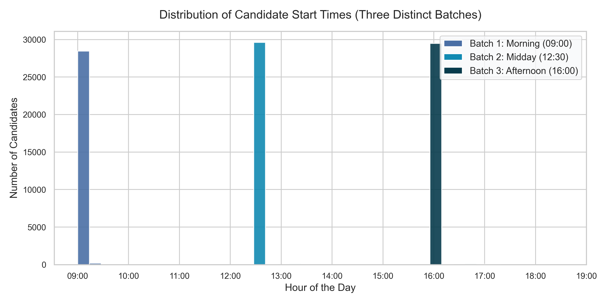
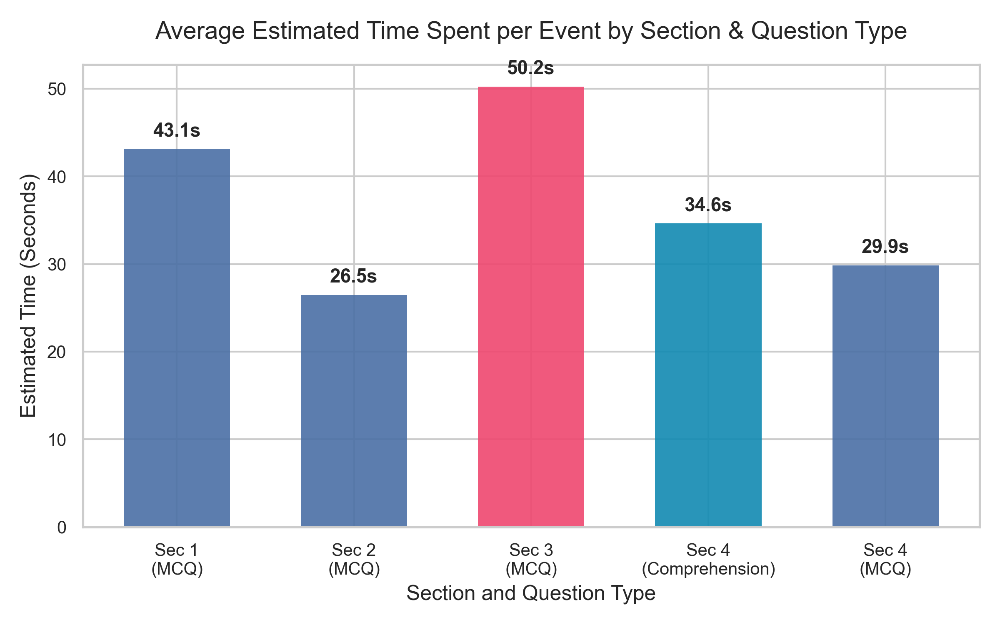
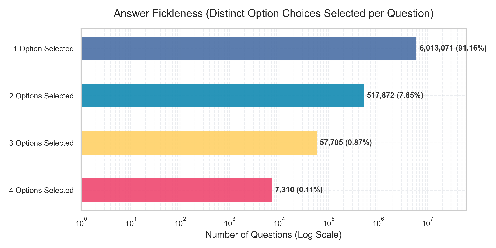
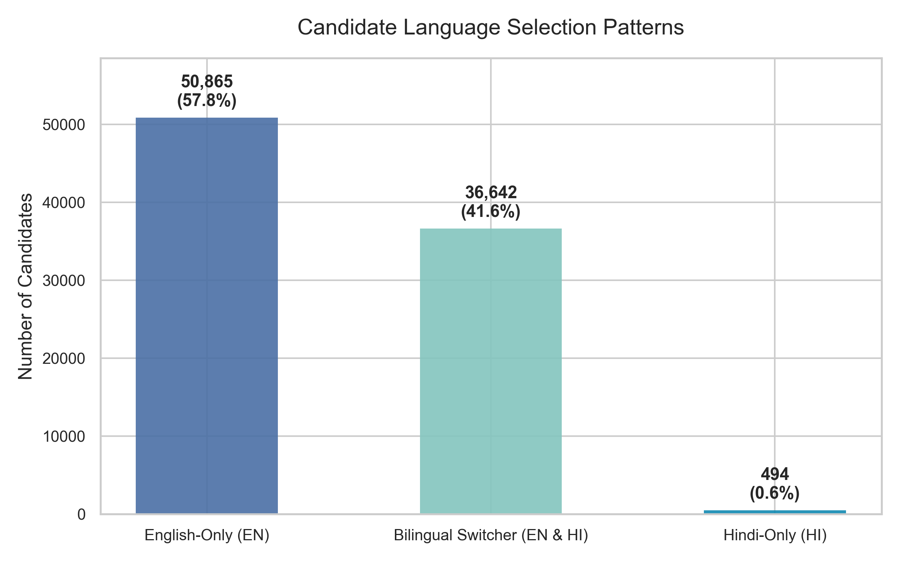

# Case Study: Exam Behaviour Analysis
**Data Analyst Assignment** | *Telemetry Interaction Log Analysis*
**Candidate**: Khushi Pandey

This repository contains the code and findings from analyzing over **8.2 million** candidate interaction logs from a single exam day, covering **88,001 unique candidates**.

---

## 1. Project Navigation
* **Core Presentation Report**: [README.md](README.md) *(This file)*
* **Data Processing & ETL Log**: [data_processing_log.md](data_processing_log.md)
* **Clean SQL Queries File**: [queries.sql](queries.sql)
* **Reproducible Python Analysis Script**: [analysis.py](analysis.py)
* **Generated Visualizations Directory**: [plots/](plots)

---

## 2. Key Insights and Findings

### A. Exam Administration & Slots

By plotting the distribution of candidate start times, we discovered that the exam is administered in **three distinct slots / batches** of approximately **29,000 candidates** each:
1. **Batch 1 (Morning)**: Starts at `09:00` (~28.6k candidates)
2. **Batch 2 (Midday)**: Starts at `12:30` (~29.6k candidates)
3. **Batch 3 (Afternoon)**: Starts at `16:00` (~29.6k candidates)



* **Data Inference**: The median exam duration (time between first and last log) is **58.74 minutes**. Since the 95th percentile is 59.83 minutes, the exam clearly enforces a strict **60-minute (1 hour) limit**, with almost all candidates utilizing their entire allotted time.
* **Visualization Design Rationale**: We chose a **continuous histogram** binned by 15-minute intervals. This design clearly shows the sharp spike in candidates starting at exactly the batch hours and the absolute drop-off between slots, making the slot structure immediately visible. Active batches are custom-colored (blue, teal, navy) to separate them visually from off-peak administrative noise (colored in light gray).

---

### B. Section Performance & Pacing

The exam has 4 sections with 25 questions each (100 total questions). Section 4 contains a mix of standard MCQs and passage-based Comprehension questions.

By analyzing the time elapsed between chronological events, we estimated the average candidate pacing:
* **Section 3 (MCQ)**: **50.24 seconds per event** (Slowest section). The top 9 most time-consuming questions in the entire exam are all located in Section 3 (averaging 53–57 seconds). This suggests Section 3 contains complex quantitative or analytical reasoning tasks.
* **Section 1 (MCQ)**: **43.12 seconds per event**
* **Section 4 (Comprehension)**: **34.62 seconds per event**
* **Section 4 (MCQ)**: **29.85 seconds per event**
* **Section 2 (MCQ)**: **26.48 seconds per event** (Fastest section). This indicates Section 2 likely comprises rapid-fire recall or general awareness questions.



* **Data Inference**: Candidates require significantly more time for Section 3 and Section 1 than the other sections, indicating higher difficulty. Passage-based Comprehension questions in Section 4 take slightly longer than standard MCQs in the same section, as expected due to reading time.
* **Visualization Design Rationale**: A **vertical bar chart** was selected because we are comparing 5 distinct, discrete categories. The bar heights make pacing comparisons instant. Exact values are printed on top of the bars to provide immediate numerical clarity without cluttering the y-axis.

---

### C. Answer Fickleness (Response Switching)

The assignment instructions warned that ~91% of events are "Auto Save" occurrences. By checking how often candidates changed their chosen answers on individual questions:
* **Stable Choices**: In **91.16% of cases**, candidates selected **only 1 option** and never changed it.
* **Revised Choices**: In **7.85% of cases**, they selected **2 options** (changed answer once). In **0.98% of cases**, they selected **3 or 4 options**.
* **Average Answer Changes**: Across the 100 questions, a candidate changes their answers an average of **8.58 times** during the entire test. This suggests strong candidate confidence and low "answer switching" hesitation.



* **Data Inference**: Candidates are highly decisive; over 91% of completed questions are answered on the first attempt and never modified. 
* **Visualization Design Rationale**: Pie/donut charts fail here because the data is extremely skewed (91.16% vs. 0.11%), causing text labels for the small slices to overlap. We implemented a **horizontal bar chart with a logarithmic scale**. The log scale ensures that even the tiny 0.11% (7,310 questions) category is clearly visible, and the horizontal alignment provides ample space to write clean, non-overlapping labels next to the bars.

---

### D. Section Navigation and Starting Preferences

We mapped which sections candidates started and ended their exam with:
* **Linear Start**: **73.9% of candidates started the exam with Section 1**, indicating a strong preference to follow the default numerical order. Section 2 (13.6%) and Section 4 (10.7%) were also common entry points.
* **Section Transitions**: The average candidate makes **4.8 section switches** during the exam. A strictly linear path (1 -> 2 -> 3 -> 4) would require exactly 3 switches.
* **Review Behavior**: The additional 1.8 switches per candidate indicate that candidates are jumping back and forth to review. Indeed, we tracked **39,634 transitions from Section 4 back to Section 3**, and **28,648 transitions from Section 4 back to Section 1** for final check-ups.
* **Exam Terminations**: **37.4% ended the exam on Section 3**, and **28.8% ended on Section 4**. Very few ended on Section 1 (15.2%) or Section 2 (18.6%).


* **Data Inference**: While candidates overwhelmingly start with Section 1, their final submissions are heavily concentrated in Section 3 and 4, which aligns with their pacing needs (finishing the hardest sections last or spending their final minutes reviewing them).
* **Visualization Design Rationale**: We chose a **grouped side-by-side bar chart** to compare the entry and exit distributions across the 4 sections. This allows the viewer to easily compare starting preferences (blue bars) against ending preferences (dark slate bars) for each section in a single visual sweep.

---

### E. Bilingualism & Language Preferences

Candidates have the option to toggle questions between English (EN) and Hindi (HI):
* **Initial Preference**: **70.0% started the exam in English**, and **30.0% started in Hindi**.
* **Language Switchers**: A massive **41.6% of candidates (36,642) switched languages at least once** during the exam! This demonstrates that a large portion of the candidate pool actively utilizes the bilingual feature to clarify or cross-verify questions in both languages.



* **Data Inference**: Over 40% of the candidate pool is bilingual in their test-taking behavior, switching between English and Hindi. Only a tiny fraction (0.6%) took the test exclusively in Hindi, indicating that Hindi-preferring candidates still use English as a reference (or vice versa).
* **Visualization Design Rationale**: A **simple three-bar chart** was used to classify candidates into distinct categories (English-Only, Bilingual, and Hindi-Only). This structure cleanly highlights the large volume of bilingual candidates compared to the monolingual segments. Clear text overlays showing raw candidate counts and percentages are added on top of the bars to support exact reporting.

---

## 3. How to Reproduce this Analysis
1. Ensure a PostgreSQL instance is running.
2. Restore the database:
   ```bash
   createdb exam_event_logs
   pg_restore -d exam_event_logs "exam_event_logs (1).dump"
   ```
3. Install dependencies:
   ```bash
   pip install pandas psycopg2-binary matplotlib seaborn
   ```
4. Run the analysis script to re-generate the metrics and plots:
   ```bash
   python analysis.py
   ```
